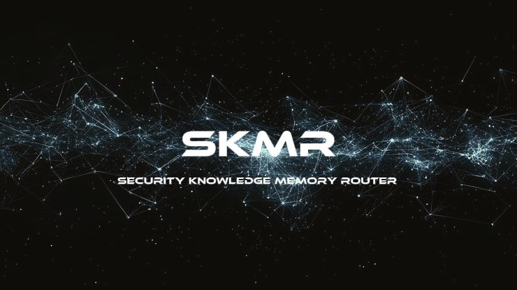
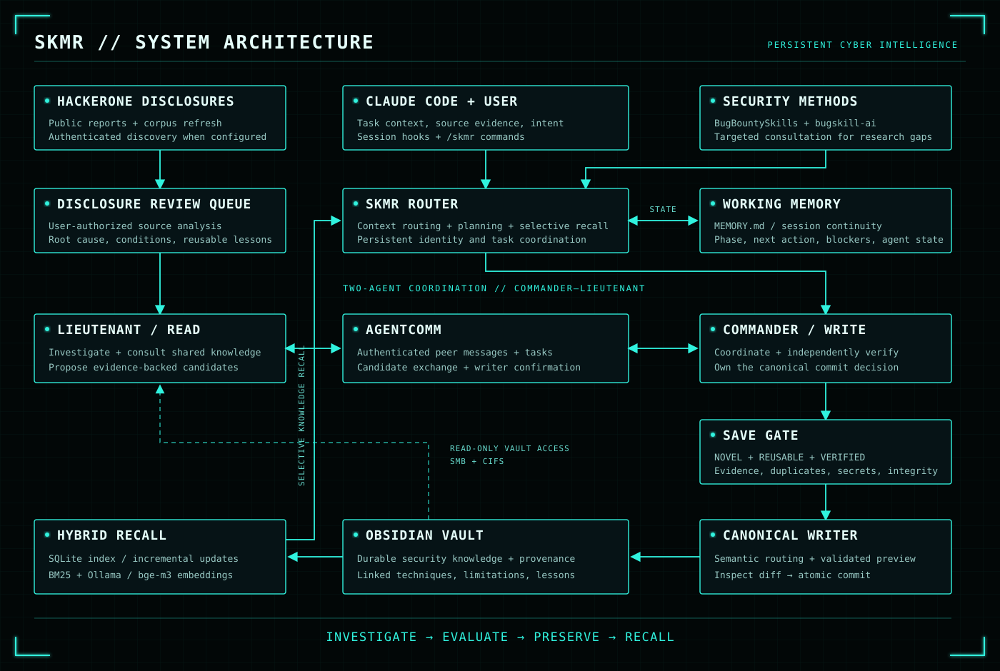

# Advanced Cyber Intelligence Management Layer: SKMR (Security Knowledge Memory Router) 🧠



## What is a Project?

**SKMR is a persistent intelligence management layer for Claude Code, designed to preserve research continuity, retain verified security knowledge, and coordinate two collaborating agents.** It connects the immediate context of an investigation with an external memory system that remains available across sessions.

AI-assisted security research is constrained by the temporary nature of conversational context. As sessions end or context is compressed, an agent can lose the reasoning behind earlier decisions, repeat unsuccessful approaches, or reconstruct knowledge that was already established. SKMR addresses this problem through two complementary forms of persistence: working memory records the state of an investigation, while an Obsidian vault preserves reusable knowledge, its provenance, and its relationships to other findings.

The project also supports **disclosure-driven learning**. Its security knowledge pipeline refreshes a local corpus of public HackerOne reports through repository snapshots and, when API credentials are configured, authenticated disclosure discovery. Newly discovered reports enter a review queue; refreshed report material supplies additional research evidence. Once the user authorizes review, the agent examines the source, identifies the underlying mechanism and prerequisites, and extracts generalized methods or limitations. Insights that satisfy **NOVEL + REUSABLE + VERIFIED** are preserved through a guarded permanent-memory workflow. Learning therefore accumulates as evidence-backed knowledge that can inform future investigations.

SKMR combines this memory model with a **two-agent operating topology**. In the Commander–Lieutenant configuration, the Commander holds WRITE authority over its vault, while the Lieutenant reads the shared knowledge, investigates assigned questions, and submits recommendations. AgentComm carries authenticated messages, tasks, and knowledge candidates between them. This supports a continuous research cycle: investigate, evaluate, preserve, and recall.

> **Persistent context. Verified learning. Coordinated intelligence.**

## System Architecture

SKMR integrates with Claude Code through commands, hooks, persistent identity, and instruction policies. The router starts from the current task and consults durable memory or external security sources when a concrete knowledge gap justifies retrieval. Planning, persistent identity, and working state help each agent resume its responsibilities across sessions.



### Two complementary memory layers

| Layer | Purpose | Persistence model |
| :--- | :--- | :--- |
| **Working memory — `MEMORY.md`** | Tracks the active task, phase, completed work, next action, blockers, and agent status. | Locked, atomic updates preserve continuity across sessions. |
| **Permanent knowledge — Obsidian** | Stores reusable techniques, verified lessons, limitations, and linked evidence. | A canonical writer governs routing, validation, preview, and commit. |

Permanent knowledge becomes searchable through an incremental **SQLite index**, lexical **BM25** retrieval, and semantic embeddings produced by **Ollama with `bge-m3`**. Hybrid retrieval combines these signals and returns a focused context. Content hashes ensure that unchanged notes are not repeatedly re-embedded; BM25 remains available when the embedding backend is unavailable.

### From evidence to durable knowledge

1. **Acquire context.** Restore agent identity and working state, and consult the task's available evidence.
2. **Refresh intelligence.** Update the disclosed-report corpus and queue newly discovered HackerOne reports for authorized review.
3. **Investigate cooperatively.** Exchange tasks, findings, and candidate lessons through AgentComm.
4. **Evaluate the lesson.** Check novelty, reuse value, verification evidence, duplicates, secrets, and knowledge integrity.
5. **Preserve through the writer.** Resolve semantic routing, inspect the preview, and atomically commit accepted knowledge into Obsidian.
6. **Recall selectively.** Retrieve relevant notes for a later decision and preserve the new investigation's working state.

The following pseudocode summarizes the control flow:

```text
SESSION START
  restore identity, topology, and working state
  refresh disclosed-report corpus
  queue newly discovered reports

AUTHORIZED REVIEW / REUSABLE RESEARCH FINDING
  analyze source evidence and existing knowledge
  evaluate NOVEL + REUSABLE + VERIFIED
  if lesson qualifies:
    READ agent  -> submit candidate to WRITE peer
    WRITE agent -> independently validate -> preview -> commit

NEXT INVESTIGATION
  identify a concrete knowledge gap
  retrieve relevant evidence through hybrid recall
  coordinate work and persist the next action
```

Vault grants determine write authority. In the default Commander–Lieutenant topology, the Lieutenant has READ access and proposes changes to its WRITE peer. A two-Commander installation is also supported: each Commander writes to its own independent vault and accesses the other's vault through a read-only share.

## Installation Methods

SKMR offers **two installation paths**, both intended for **Linux**. Windows users run the installer inside a Linux WSL distribution.

| | **A — Full Auto Installer** | **B — Manual Installer** |
| :--- | :--- | :--- |
| **Environment** | Creates `kali-lab` and `ubuntu-lab` Docker containers. The first Commander uses Kali; the other agent uses Ubuntu. | Installs into the current Linux environment, with the peer configured on its own machine or environment. |
| **Provisioning** | Installs required packages, Claude Code, Ollama, `bge-m3`, SKMR, and AgentComm. | Supports interactive local provisioning while the operator supplies the deployment and connection settings. |
| **Connections and memory** | Configures shared transport tokens, agent identity, vault grants, Samba, and read-only CIFS mounts using detected Docker addresses. | The operator configures identities, grants, networking, AgentComm connections, and vault sharing or mounts. |
| **Operator input** | Agent names and ranks, each Commander's existing Obsidian vault path, optional HackerOne API credentials, and Claude account login inside each lab. | Environment-specific paths, credentials, peer addresses, transport roles, and sharing configuration. |
| **Best suited to** | A reproducible local deployment of two cooperating agents. | A main Linux terminal working with an agent on a remote machine, or a customized deployment. |

The installer copies the bundled **`00 System`** directory into each selected WRITE vault and performs installation checks, vault validation, indexing, and subsystem diagnostics. READ agents use their WRITE peer's shared files. Full auto prints the container entry and Claude login commands when installation checks pass.

### Installation Documentation

- **[Full Auto Installation Guide](docs/install_full_auto.md)** — Docker provisioning, agent setup, vault connections, and startup.
- **[Manual Installation Guide](docs/install_manual.md)** — local installation, remote peers, and operator-managed configuration.

## Introduction & Easy Setup

Project introductions and easy installation walkthroughs are available on **anezatra_official**:

[](https://www.youtube.com/watch?v=z-4xg8m6OmA)

[Visit the official YouTube channel](https://www.youtube.com/@anezatra_official)

## Contact

For project inquiries and collaboration: **[anezatra@gmail.com](mailto:anezatra@gmail.com)**.
